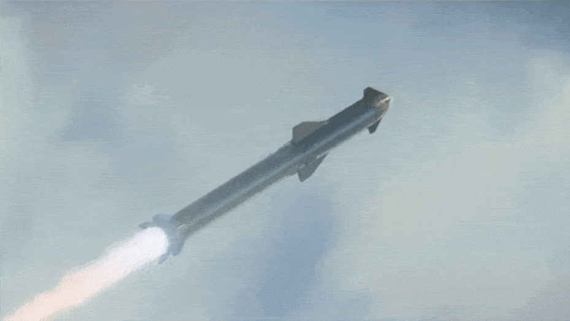

## RAILS PROJECT
### SPACE LAUNCH TRACKING AND LEARNING PLATFORM
___

___

#### Project Details

* The project is a rails app that will act as a forum and an information hub for space related content
 
* The App is built on the following stack

    * Rails (v 6.1.4)
    * Ruby (v 3.0.2)
    * Postgres
    * RSpec
    * Factory bot
    * Docker

* The services offered are
    * Mailing service
    * Authentication with Devise
    * Data streaming from spaceX
    * Youtube vide embedding

* To run the application on docker you have to run the following commands
    * docker-compose build
    * docker-compose up

#### Development Notes
- Testing was carried out using rspec and with heavy emphasis on practicing Test Driven Development
- Rspec configurationns were changed for ideal testing routines and adding formating to read the documentation better
- Feature isolation was also observed with relevant features having their own branch on the github repository
- Coupling of Controllers, Models was avoided with complete component isolation
- The development cycle was an iterative cycle especially with the testing being carried out write before running a feature and doing the same constantly
- This was enabled with the debugging tool pry
- API Keys are secured in private .env files for any need for the .env please reach out to me or generate a similar api key at the [Nasa Api Site]('https://api.nasa.gov/') or the [Google Developer Site](https://developers.google.com/) and get the youtube v3 api secret keys